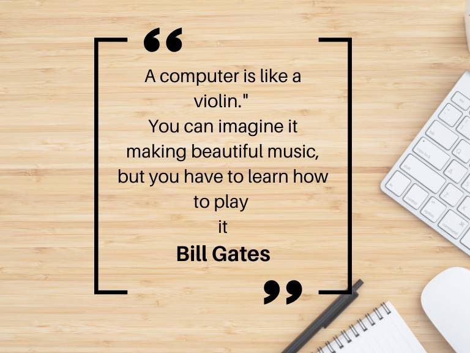

# Eric Sun's User Page
## Table of Contents
- [Eric Sun's User Page](#eric-suns-user-page)
  - [Table of Contents](#table-of-contents)
  - [Hello World](#hello-world)
  - [Quote](#quote)
  - [Code](#code)
  - [List](#list)
  - [Task Lists](#task-lists)

## Hello World
**Welcome to my page**

Just for [fun](https://www.youtube.com/watch?v=dQw4w9WgXcQ)

## Quote
> “A computer is like a violin.”


[Here is the picture](./image.png)
## Code
```python
print("Hello World")
```

## List
Sport I prefer the most:
1. Snowboarding
2. Swimming
3. Ultimate
4. Basketball
   

Programming Language I know:
- Python
- Java
- C
- C++
- JavaScript
- SQL

## Task Lists
- [x] Pictures
- [x] Headings
- [x] Styling text
- [x] Quoting text
- [x] Quoting code
- [x] External Links
- [x] Section links
- [x] Relative links (Link to another .md file or an image in your repo. If linking to an image, encode it as a regular link rather than an image.)
- [x] Ordered and Unordered Lists
- [x] Task lists

[Top](#eric-suns-user-page)
